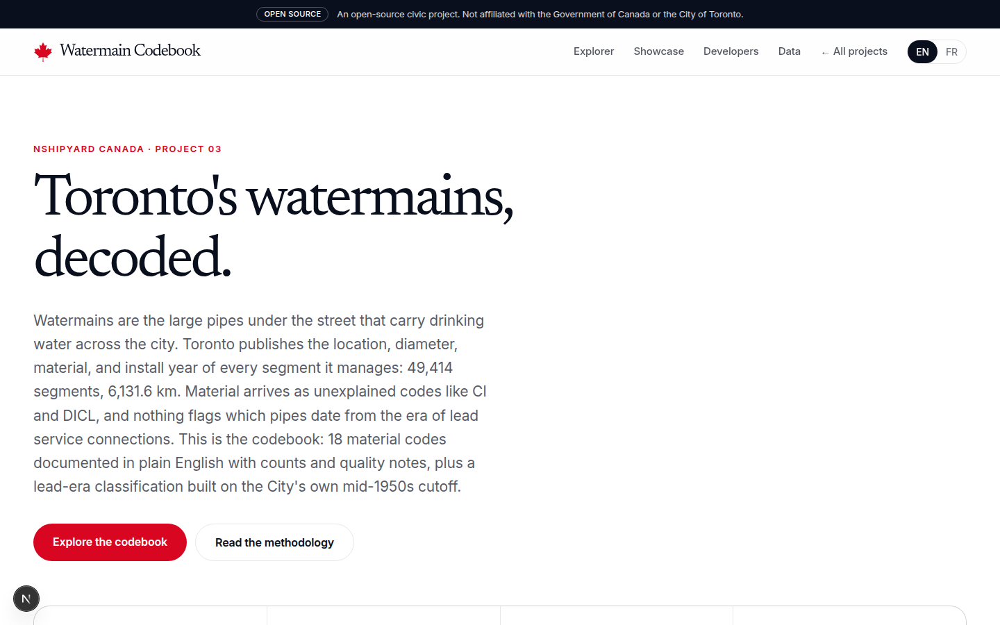
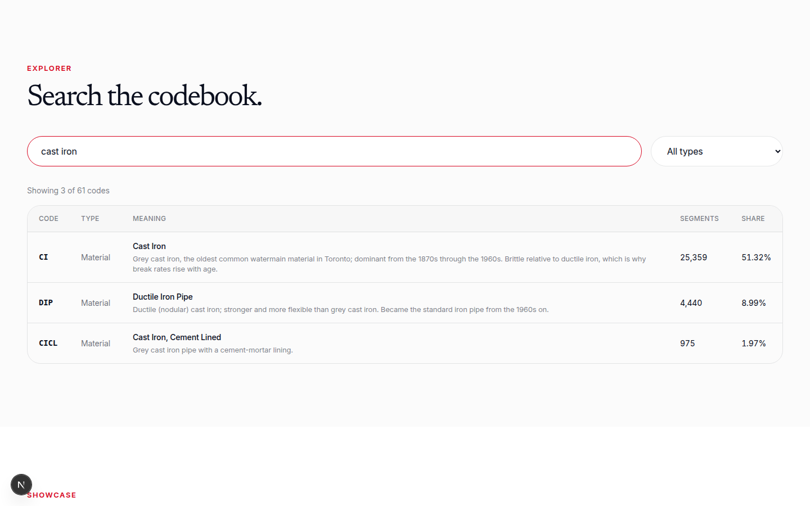
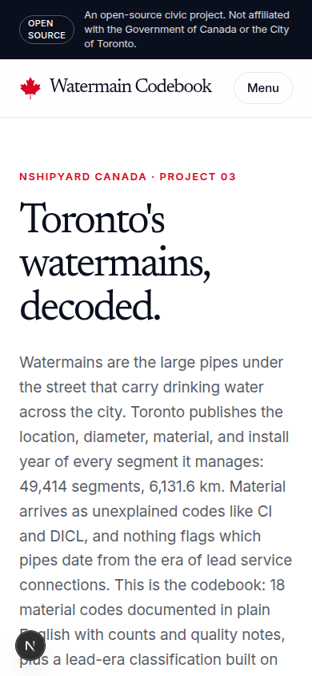

# toronto-watermain-codebook

Toronto's 49,414 watermain segments decoded: 18 material codes in plain English, diameters, function codes, and a lead-era classification by ward. Nshipyard Canada project 03.

An open-source civic project. Not affiliated with the Government of Canada or the City of Toronto.

## What it is

The City of Toronto publishes the location, diameter, material, and install year of every watermain segment it manages, 6,131.6 km of pipe. Material arrives as unexplained codes like CI and DICL, and nothing flags which pipes date from the era of lead service connections. This project is the missing codebook plus the join the raw file cannot do: which wards carry the oldest pipes.

Key findings, computed from the source on 2026-10-08:

- Cast iron (CI) is 25,359 segments, 51.3% of the network. PVC is 12,994, 26.3%.
- 16,949 segments (2,014.9 km) were installed before 1955, the City of Toronto's lead-service era cutoff. The lead-era cohort is 91.6% cast iron.
- Toronto-St. Paul's has the highest lead-era share: 84.2% of its distribution network predates 1955. Etobicoke-Lakeshore carries the most lead-era pipe by length: 206.0 km.
- No segment in the dataset carries an explicit lead material code. The lead-era flag is an age-based inference about pipe vintage, never a measurement of lead.

## Screenshots





## Data files

| File | Contents |
|---|---|
| `data/watermain_codebook.csv` | 61 codes: 18 materials, 3 function codes, 15 diameters, with plain-English meanings, counts, share, and quality notes |
| `data/lead_classification.csv` | 49,414 segments with lead-era classification, ward, and the rule applied |
| `data/summary.json` | Network totals, material mix, lead classes, decade distribution, ward ranking, limitations |

Raw source files live in `data/raw/` (not committed): the City of Toronto "Watermains" package distribution and transmission datastore dumps, retrieved 2026-10-08, plus the 25-ward boundary file used for ward assignment.

## Methodology

1. Source: City of Toronto Open Data "Watermains" package (https://open.toronto.ca/dataset/watermains/), Open Government Licence - Toronto. Distribution: 46,923 segments, 5,586.4 km. Transmission: 2,491 segments, 545.2 km. Updated daily by the City.
2. Material codes are decoded from standard water-industry usage; the source publishes no codebook. Diameter units are inferred as millimetres from standard pipe sizes. Watermain Type codes (0, 1, 2) are inferred from file context.
3. Lead rule: construction year before 1955 counts as lead-era, from the City of Toronto's statement that lead water service pipes affect homes built before the mid-1950s (toronto.ca, Lead & Drinking Water).
4. Measured versus inferred: the dataset measures pipe location, material code, diameter, and install year. Lead content is never measured; the era flag is inferred. These are watermains (street pipes), not service connections, and health conclusions are out of scope.
5. Wards are assigned by segment midpoint against the City's 25-ward model. Segments outside every ward polygon are excluded from ward tables.
6. Build it yourself: `python3 scripts/build_data.py` (needs the raw files in `data/raw/`).

## App

Next.js 16 + TypeScript + Tailwind. English/French toggle, codebook explorer with search and type filters, showcase (lead-era pipe by ward, network age by decade, lead-era material mix), methodology, REST + OpenAPI, MCP tools, CSV downloads.

```bash
npm install
npm run dev
```

## API

- `GET /api/v1/watermain/codes?q=ductile&type=material` - search the codebook
- `GET /api/v1/watermain/lead` - lead-era classes and ward ranking
- `GET /api/v1/watermain/lead?ward=19` - one ward's lead-era rank, km, and share
- `GET /api/v1/watermain/summary` - full summary document
- `GET /api/openapi.json` - OpenAPI 3.1 spec
- `POST /mcp` - JSON-RPC 2.0 MCP server. Tools: `watermain_lookup`, `watermain_lead_risk`, `watermain_summary`

## Author

**Richardson Dackam** - [X (@richardsondx)](https://x.com/richardsondx) · [GitHub](https://github.com/richardsondx)

## License

MIT. Pipe data is © City of Toronto (open data, Open Government Licence - Toronto); the codebook and classifications are original work.
